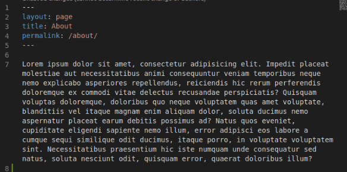

# MA-PP
> a minimal blog from Mobile App of Awesome Muslim Life

## How to add Some Post 
1. enter to '_posts' directory
2. make file with markdown exstension. example : mystory.md
3. the format post like shown bellow

> 

## How to add Some Page
1. enter to this repo/folder (make sure you are in root directory)
2. add file with markdown exstension. example : test.md
3. the format page just like image bellow

> 

## How to edit Some Page
1. enter to this repo/folder (make sure you are in root directory)
2. just edit which the page file you wanna edit in markdown format

## Credits

this documentation will improve next as soon

many thanks for developers who colaborate this awesome project

this page was generated from [**here**](https://github.com/willianjusten/minimal-blog)